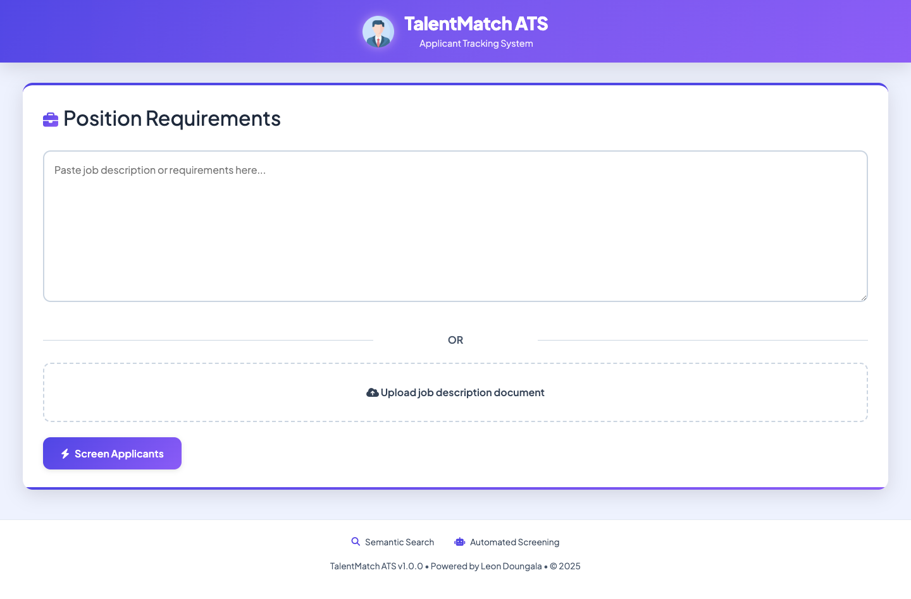

# TalentMatch ATS : Applicant Tracking System

## Overview

TalentMatch ATS is a sophisticated recruitment tool that uses artificial intelligence to revolutionize the hiring process. By analyzing resumes against job descriptions, it identifies the most qualified candidates with unprecedented accuracy. The system employs semantic search capabilities and RAG (Retrieval-Augmented Generation) technology to understand the context and requirements of positions better than traditional keyword-based systems.

> **Note:** This is a demo version provided free of charge, created to illustrate my skills and capabilities in AI application development. It is not intended for commercial use.




**TalentMatch ATS** is an AI-driven applicant tracking system (ATS) that leverages semantic search and Retrieval-Augmented Generation (RAG) to match CVs with job descriptions. It automates CV parsing, semantic similarity, and relevance scoring to streamline candidate selection.

---

## Features

- Semantic CV matching using vector search
- Automatic CV parsing and structuring (PDF → JSON)
- Relevance-based candidate ranking via OpenAI LLMs
- Original CV PDF storage and viewing
- Web interface for uploading JDs and analyzing results

---

## Tech Stack

- **Backend**: Python (Flask)
- **Frontend**: HTML, CSS, JavaScript, Bootstrap
- **AI**: OpenAI GPT-4o, text-embedding-ada-002, LangChain
- **OCR & Parsing**: PyMuPDF, pdfplumber, EasyOCR
- **Search Engine**: Chroma (Vector DB)
- **Database**: PostgreSQL (CV metadata + PDF storage)

---

## Project Structure

```
```plaintext
RAG-ATS-Semantic-Matching-Search-CV-AI/
├── src/
│   ├── augmenter/
│   │   ├── cv_processor.py         # Handles CV extraction, structuring, and saving
│   │   └── DataTools.py            # Converts files (e.g., .docx to .pdf)
│   ├── embedding/
│   │   └── embeddings.py           # Manages embeddings for vector search
│   ├── prompts/
│   │   └── prompt_templates.py     # Templates for structured CV generation
│   ├── retriever/
│   │   ├── helper_retriever.py     # Assists in similarity search and data retrieval
│   │   └── retriever.py            # Performs vector-based semantic search
│   ├── static/                     # Static assets (e.g., CSS, JS)
│   ├── templates/                  # HTML templates for the web app
│   ├── utils/
│   │   └── logger.py               # Logging utility
│   └── main.py                     # Entry point for the Flask web app
├── env/                            # Contains environment configuration
├── requirements.txt                # Python dependencies
└── README.md                       # Project documentation
```

---

## Setup Instructions

### Prerequisites

- Python 3.8+
- PostgreSQL running locally

### Installation

```bash
git clone https://github.com/LeonDoungala22/RAG-ATS-Semantic-Matching-Search-CV-AI-v1.0.0.git
cd RAG-ATS-Semantic-Matching-Search-CV-AI-v1.0.0
pip install -r requirements.txt
```

### Configure `.env`

Create a `.env` file in the root directory:

```
OPENAI_API_KEY=
POSTGRES_USER=
POSTGRES_PASSWORD=
POSTGRES_HOST=
POSTGRES_PORT=
POSTGRES_DB=
```

---

## Usage

### 1. Ingest CVs

Place your PDFs in:

```
src/data/cv/
```

Then run:

```bash
python src/augmenter/cv_processor.py
```

### 2. Launch Web App

```bash
python src/main.py
```

Then open [http://localhost:5000](http://localhost:5000) to use the interface.

---

## License

This project is licensed under the MIT License.
See the [LICENSE](LICENSE) file for details.

---

## Contact

For questions or support, feel free to reach out:

- **GitHub**: [LeonDoungala22](https://github.com/LeonDoungala22)
- **Portfolio**: [leondoungala22.github.io](https://leondoungala22.github.io)
- **Email**: doungala.leon@gmail.com
